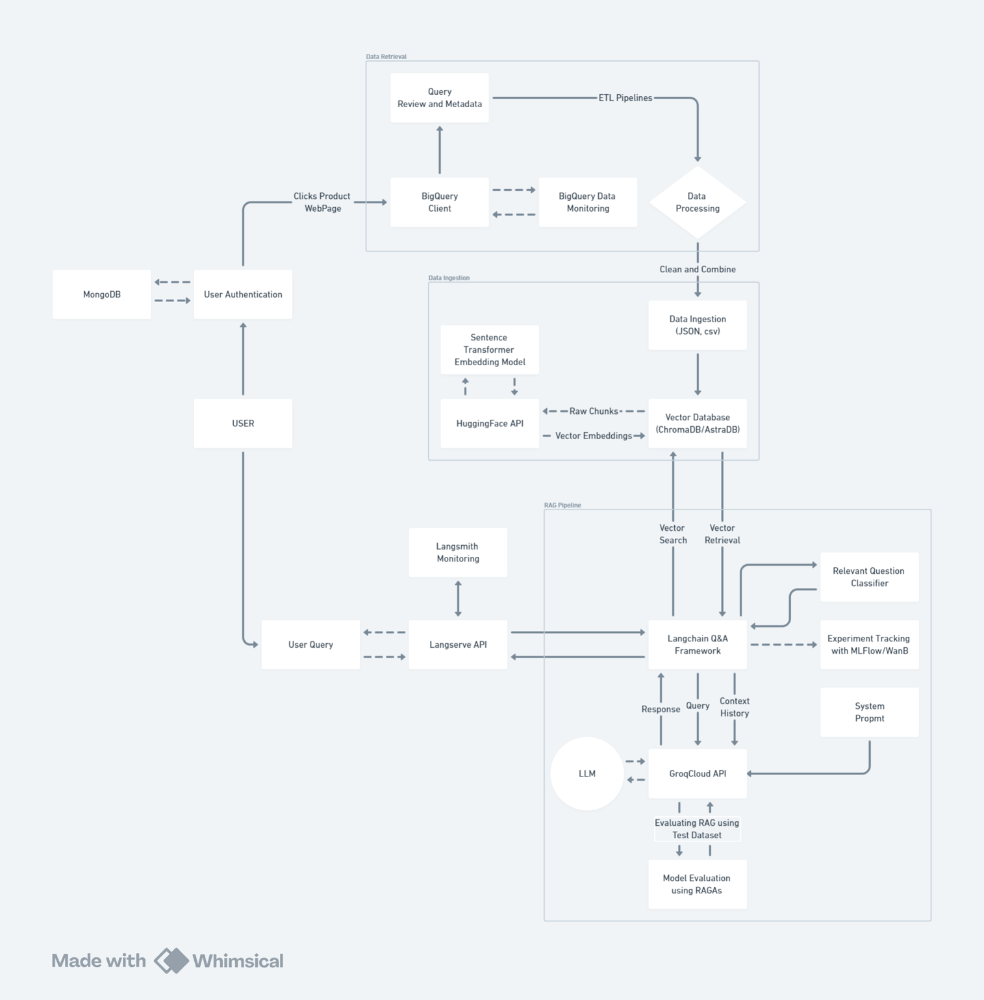
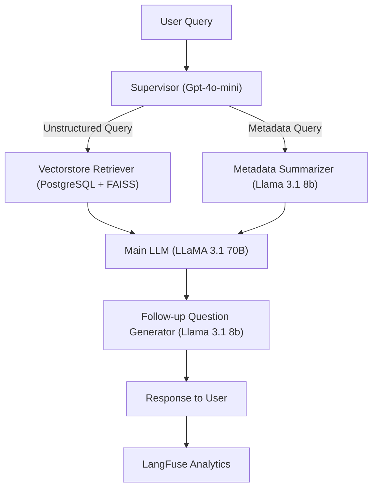

# **'Verta Chatbot' Model Documentation**

## **Overview**

The **Verta (Base Model)** Chatbot architecture is a robust solution for processing user queries in real time with high accuracy and contextual relevance. By combining advanced retrieval techniques with state-of-the-art generative models, the chatbot provides precise and engaging responses. The system seamlessly integrates multiple components, including retrieval systems, metadata summarization modules, and language models, all orchestrated by a centralized **Supervisor Module**.

The system also features integration with **LangFuse**, which ensures comprehensive monitoring of query traces, token usage, and cost efficiency. This modular and scalable architecture is optimized for real-world applications in product information retrieval, customer support, and interactive recommendations.

## **Detailed Architecture**

### **Core Components**


| **Component**               | **Description**                                                                                                      | **Tools Used**                                                   |
|------------------------------|----------------------------------------------------------------------------------------------------------------------|------------------------------------------------------------------|
| **Supervisor Module**        | Routes user queries to the appropriate pipeline (metadata summarization or vector-based retrieval).                  | GPT-4o-mini, LangFuse for decision trace logging.                |
| **Metadata Summarizer**      | Processes structured product metadata (e.g., specifications, pricing) into human-readable summaries.                 | Llama3.1-8B                                                     |
| **Vectorstore Retriever**    | Retrieves relevant unstructured data (e.g., product reviews) based on vector similarity.                             | FAISS, HuggingFace MiniLM for embeddings.                         |
| **Main LLM**                 | Combines inputs from various modules to generate a cohesive and contextually accurate response.                      | Llama3.1-70B                                                    |
| **Follow-up Question Generator** | Suggests follow-up questions based on generated responses and query context to enhance engagement.                  | Llama3.1-8B                                                     |
| **LangFuse**       | Monitors system performance, tracks token usage, query latency, and generates detailed cost reports.                 | LangFuse                                                        |

---

### **Architecture Workflow**



---

## **Component Details**

### **1. Supervisor Module**
- **Model:** gpt-4o-mini
- **Role**:
   - Acts as the decision-making layer, routing queries based on their type (metadata vs. unstructured).
- **Workflow**:
   - Receives user queries through the `dev/stream` API.
   - Routes queries to either the Metadata Retriever or the Vectorstore Retriever.

### **2. Vectorstore Retriever**
- **Database**: FAISS Vectorstore
- **Embedding Model**: HuggingFace All-MiniLM-v6
- **Role**:
   - Retrieves unstructured textual data (e.g., reviews, descriptions) using vector embeddings.
- **Workflow**:
   - Converts textual data into vector embeddings using HuggingFace's MiniLM.
   - Stores and retrieves embeddings using FAISS for fast similarity-based searches.
   - Fetches contextually relevant documents for user queries.
   - Handles unstructured data retrieval using vector similarity techniques.


### **3. Metadata Summarizer**
- **Model:** llama3.1-8b
- **Role**:
   - Summarizes structured data into concise and readable formats.
- **Workflow**:
   - Processes structured metadata (e.g., product specs, features, pricing).
   - Outputs a human-readable summary for the Main LLM to use in response generation.
- **Example**:
   - Input: Product metadata.
   - Output: "This product features lightweight design, noise cancellation, and a 10-hour battery life."


### **4. Main LLM**
- **Model:** llama3.1-70b
- **Role**:
   - Synthesizes a comprehensive response by combining:
     - User inputs.
     - Metadata summaries.
     - Contextual information from retrieved documents.
- **Workflow**:
   - Receives preprocessed data from the Metadata Summarizer and Vectorstore Retriever.
   - Generates coherent, detailed, and context-aware responses.
- **Example**:
   - Input: “What are the best features of this product?”
   - Output: "The product offers industry-leading noise cancellation, lightweight construction, and a battery life of 10 hours."

### **5. Follow-up Question Generator**
- **Model:** llama3.1-8b
- **Role**:
   - Enhances the user experience by generating relevant follow-up questions.
- **Workflow**:
   - Evaluates the interaction context and the generated response.
   - Suggests clarifying or exploratory follow-up queries.
- **Example**:
   - "Would you like me to compare this product with similar options?"

---

### **6. LangFuse Analytics**
- **Role**:
   - Monitors and logs operational metrics across the entire pipeline.
- **Features**:
   - **Trace Logging**: Tracks module inputs, outputs, and execution times.
   - **Token Monitoring**: Logs token consumption for summarization, retrieval, and response generation.
   - **Cost Attribution**: Provides insights into the costs of API interactions and token usage.
- **Use Case**:
   - Analyzing the pipeline’s efficiency and optimizing cost-to-performance ratios.

---

## **Pipeline Execution Workflow**

1. **User Query Submission**  
   - Users interact with the chatbot via the frontend interface, which sends queries to the backend through the `dev/stream` API.

2. **Supervisor Routing**  
   - The Supervisor Module determines whether the query relates to structured metadata or unstructured contextual data.

3. **Data Retrieval**  
   - Metadata queries → Metadata Retriever fetches structured data.
   - Contextual queries → Vectorstore Retriever retrieves relevant unstructured data.

4. **Metadata Summarization**  
   - Summarizes structured metadata for clarity and brevity.

5. **Response Generation**  
   - The Main LLM combines all inputs to generate a coherent and relevant response.

6. **Follow-up Engagement**  
   - A follow-up query is generated to improve user interaction and clarify ambiguous queries.

7. **Analytics Logging**  
   - LangFuse logs the entire interaction, including token usage, trace data, and performance metrics.

---

## **API Integration**

### **Request Example**
```json
{
  "query": "What are the features of this product?",
  "parent_asin": "B08K2S3D2K",
  "user_id": "user_12345",
  "log_langfuse": true,
  "stream_tokens": true
}
```

### **Response Example**
```json
{
  "response": "This product features noise cancellation, long battery life, and a sleek design.",
  "follow_up": "Would you like me to compare this product with similar options?"
}
```
