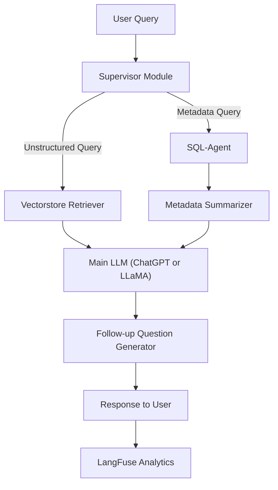

# **Base Model RAG Chatbot Architecture**

## **Overview**

The **Base Model RAG (Retrieve-then-Generate)** Chatbot is designed to process and respond to user queries dynamically. By leveraging advanced retrieval and generation techniques, the architecture ensures high contextual accuracy and detailed responses. The system intelligently routes queries to specialized modules like SQL agents, retrievers, and summarization models, all orchestrated under a supervisor module.

In addition to real-time functionality, the system integrates with **LangFuse Analytics** for monitoring query traces, token usage, and overall performance.

---

## **Detailed Architecture**

### **Core Components**

1. **Supervisor Module**:  
   Centralized routing mechanism that determines the appropriate pipeline (metadata or unstructured queries).  

2. **SQL-Agent**:  
   Interacts with a PostgreSQL database to fetch structured data such as product metadata and user reviews.  

3. **Vectorstore Retriever**:  
   Retrieves unstructured data (e.g., detailed user reviews) using **FAISS** for vector similarity search.  

4. **Metadata Summarizer**:  
   Converts retrieved metadata into concise summaries.  

5. **Main LLM**:  
   Synthesizes final responses, combining user input, structured metadata, and retrieved documents.  

6. **Follow-up Question Generator**:  
   Enhances user engagement by suggesting follow-up questions based on prior interactions.  

7. **LangFuse Analytics**:  
   Tracks operational data, including query traces, token usage, and cost attribution for each stage of the pipeline.  

---

### **Architecture Workflow**

The following diagram visually represents the architecture:



---

## **Component Details**

### **1. Supervisor Module**
- **Role**: Routes user queries based on type:
  - Metadata-related queries → SQL-Agent.
  - Contextual/unstructured queries → Vectorstore Retriever.
- **Integration**:  
   - Logs routing decisions via **LangFuse**.  
   - Tracks processing times for analytics.

---

### **2. SQL-Agent**
- **Role**: Fetches structured data from a PostgreSQL database.  
- **Data Retrieved**:  
  - Product features, pricing, and user reviews.  
  - Metadata like ASIN-specific details.  
- **Example Query**:  
  ```sql
  SELECT * FROM metadata WHERE asin = 'B08K2S3D2K';
  ```
- **LangFuse Logging**: Tracks SQL execution and data preparation times.

---

### **3. Vectorstore Retriever**
- **Role**: Handles unstructured data retrieval for context-driven queries.  
- **Workflow**:
  - Embeddings generated via **HuggingFace’s MiniLM** model.  
  - Similarity search performed on FAISS database.  
  - Relevant documents fetched based on user query context.  
- **Example**: Searching user reviews related to noise cancellation.  
- **LangFuse Analytics**: Logs retrieval operations and embedding token usage.

---

### **4. Metadata Summarizer**
- **Role**: Summarizes structured metadata retrieved by the SQL-Agent.  
- **Example Output**:  
  - Input: Product pricing, dimensions, and features.  
  - Output: "This product features noise cancellation, lightweight design, and is priced at $99.99."  
- **LangFuse Analytics**: Tracks token usage for summarization tasks.

---

### **5. Main LLM (e.g., ChatGPT, LLaMA)**
- **Role**: Synthesizes final chatbot responses by combining:  
  - User input.  
  - Summarized metadata.  
  - Retrieved unstructured data.  
- **Example Query Handling**:
  - Input: "What are the key features of this product?"  
  - Output: "This product offers superior noise cancellation, long battery life, and a sleek design."  
- **LangFuse Analytics**: Tracks:
  - Token usage.  
  - API credits consumed.  

---

### **6. Follow-up Question Generator**
- **Role**: Generates follow-up questions to improve user engagement.  
- **Example**:  
  - After providing product details:  
    - "Would you like to compare this product with similar options?"  
- **LangFuse Analytics**: Tracks follow-up question generation and engagement metrics.

---

### **7. LangFuse Analytics**
- **Role**: Provides full visibility into the operational pipeline.  
- **Features**:
  - **Trace Logging**: Tracks input/output at every pipeline stage.  
  - **Token Monitoring**: Logs token consumption for summarization, retrieval, and response generation.  
  - **Cost Attribution**: Calculates API and infrastructure costs per query.  

---

## **Pipeline Execution Workflow**

### **1. User Query Submission**
- Users submit a query via the chatbot frontend using the `dev/stream` API.  

### **2. Supervisor Decision**
- The Supervisor Module determines whether the query relates to metadata or unstructured data.  

### **3. Data Retrieval**
- Metadata queries → SQL-Agent retrieves structured data.  
- Unstructured queries → Vectorstore Retriever fetches relevant documents.  

### **4. Metadata Summarization**
- SQL-Agent output is summarized for concise context delivery.  

### **5. Final Response Generation**
- The Main LLM synthesizes the final response.  

### **6. Follow-up Engagement**
- A follow-up question is generated to clarify or engage further.  

### **7. LangFuse Analytics Logging**
- Tracks the entire interaction, including token usage and query traces.

---

## **API Integration**

### **Request Example**
```json
{
  "query": "What are the features of this product?",
  "parent_asin": "B08K2S3D2K",
  "user_id": "user_12345",
  "log_langfuse": true,
  "stream_tokens": true
}
```

### **Response Example**
```json
{
  "response": "This product features noise cancellation, long battery life, and a sleek design.",
  "follow_up": "Would you like me to compare this product with similar options?"
}
```

---

## **LangFuse Analytics Integration**

### **Key Metrics Tracked**
1. **Trace Logging**: Captures each module’s input/output.  
2. **Token Usage**: Tracks tokens consumed by:  
   - Metadata Summarization.  
   - Main LLM.  
   - Follow-up Question Generator.  
3. **Cost Attribution**: Calculates API credits and infrastructure costs.  

---

## **Future Improvements**

1. **Optimization**:
   - Fine-tune LLMs to reduce token usage.  
   - Implement caching for frequently queried metadata.  

2. **Expand Retrieval Capabilities**:
   - Add additional document retrievers for new data sources.  

3. **User Feedback Loop**:
   - Incorporate real-time user feedback into LangFuse analytics for adaptive response generation.  
