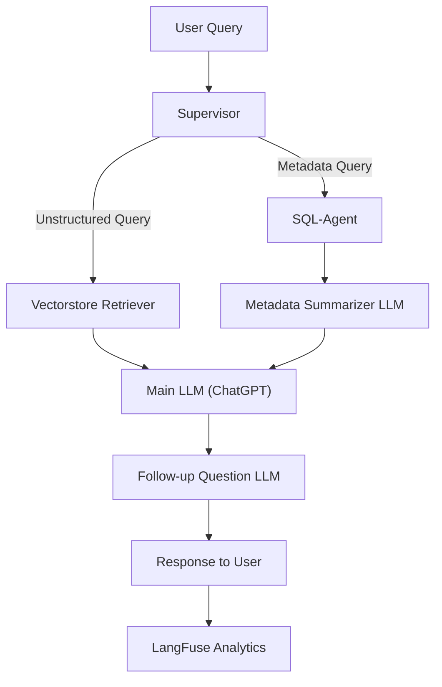

# **Base Model RAG Chatbot Architecture**

## **Overview**

The **Base Model RAG (Retrieve-then-Generate)** Chatbot is a sophisticated architecture designed to handle complex user queries by dynamically retrieving relevant information and generating human-like responses. This architecture leverages multiple modules, including retrieval agents, summarization models, and generative language models, to ensure high accuracy and context-awareness in responses.

The architecture is integrated with LangFuse for tracking token usage, query traces, and resource consumption, providing full visibility into operations and performance.

---

## **Architecture Overview**

### **RAG Chatbot Workflow**

The Base RAG Chatbot consists of the following components:

1. **Supervisor Module**: Orchestrates the flow of queries across different agents and modules based on query type.
2. **SQL-Agent**: Retrieves structured product metadata and user reviews from a PostgreSQL database.
3. **Vectorstore Retriever**: Uses FAISS to retrieve relevant documents based on embeddings of unstructured data like reviews.
4. **Metadata Summarizer LLM**: Summarizes product metadata into concise information for user queries.
5. **Main LLM (ChatGPT or Similar)**: Synthesizes responses by combining user inputs and retrieved context.
6. **Follow-up Question Generator**: Generates follow-up questions to improve engagement and clarify ambiguous user inputs.
7. **LangFuse Integration**: Tracks traces, token usage, query logs, and API costs for each interaction.

---

### **Workflow Diagram**



---

## **Pipeline Components**

### **1. Supervisor Module**
- **Role:** Routes queries to the appropriate agents based on the query type:
  - Metadata queries are sent to the SQL-Agent for structured data retrieval.
  - Context-based queries are routed to the Vectorstore Retriever.
- **Integration with LangFuse:**
  - Logs routing decisions and query traces for analytics.

---

### **2. SQL-Agent**
- **Role:** Retrieves structured metadata and user reviews from a PostgreSQL database.
- **Workflow:**
  - Executes SQL queries to fetch data such as product features, ratings, and reviews.
  - Prepares data for the Metadata Summarizer.
- **Example Use Case:** Fetching product features, pricing, and review summaries for specific ASINs.
- **Integration with LangFuse:**
  - Logs database queries and processing times.

---

### **3. Vectorstore Retriever**
- **Role:** Retrieves unstructured data (e.g., user reviews, product descriptions) based on relevance.
- **Workflow:**
  - Converts data into embeddings using HuggingFace's MiniLM model.
  - Stores embeddings in a FAISS vector database for efficient retrieval.
  - Fetches relevant documents based on user queries.
- **Integration with LangFuse:**
  - Tracks document retrieval operations and token usage for embedding calculations.

---

### **4. Metadata Summarizer LLM**
- **Role:** Summarizes metadata retrieved by the SQL-Agent into a concise format.
- **Workflow:**
  - Processes structured data like features, ratings, and pricing.
  - Returns a summarized version of the metadata to the Main LLM.
- **Example Use Case:** Condensing product information for user queries like “Tell me about this product.”
- **Integration with LangFuse:**
  - Logs token usage for summarization tasks.

---

### **5. Main LLM (ChatGPT or Similar)**
- **Role:** Synthesizes final responses using user queries, metadata summaries, and retrieved documents.
- **Workflow:**
  - Combines context retrieved from SQL-Agent, Vectorstore Retriever, and Metadata Summarizer.
  - Generates coherent and context-aware responses.
- **Example Use Case:** Answering user questions like “What are the top features of this product?”
- **Integration with LangFuse:**
  - Tracks token usage and generates logs for each interaction.

---

### **6. Follow-up Question Generator**
- **Role:** Improves engagement by generating follow-up questions to ambiguous or incomplete queries.
- **Workflow:**
  - Evaluates user queries and responses.
  - Generates follow-up questions for clarification or additional context.
- **Example Use Case:** Suggesting follow-up queries like “Would you like to compare this product with similar items?”
- **Integration with LangFuse:**
  - Logs generated follow-up questions and token usage.

---

### **7. LangFuse Analytics**
- **Role:** Tracks and logs all interactions within the pipeline.
- **Features:**
  - **Trace Logging:** Captures every stage of the pipeline, including input/output and processing time.
  - **Token Usage Tracking:** Monitors tokens consumed by LLMs for summarization, retrieval, and generation.
  - **Query Tracking:** Logs user queries and metadata for analytics.
  - **Cost Attribution:** Calculates API credits consumed per request.
- **Example Use Case:** Analyzing token usage and costs for a specific query.

---

## **Pipeline Execution**

### **Step-by-Step Workflow**

1. **User Query Submission**
   - Users submit queries via the chatbot frontend using the `dev/stream` API.

2. **Supervisor Routing**
   - The Supervisor module determines the query type:
     - Metadata queries → Routed to SQL-Agent.
     - Contextual queries → Routed to Vectorstore Retriever.

3. **Data Retrieval**
   - SQL-Agent retrieves structured data (e.g., product metadata).
   - Vectorstore Retriever fetches relevant unstructured documents.

4. **Metadata Summarization**
   - SQL-Agent output is summarized by the Metadata Summarizer LLM.

5. **Response Generation**
   - Main LLM synthesizes a response using user input, metadata summaries, and retrieved context.

6. **Follow-up Questions**
   - Follow-up Question Generator evaluates user interactions and suggests additional queries.

7. **Response Delivery**
   - The chatbot delivers the response and follow-up questions to the user.

8. **Analytics Logging**
   - LangFuse logs traces, token usage, and query details for analysis.

---

## **Integration with Frontend**

### **dev/stream API**

- **Purpose:** Processes user queries and delivers responses via a RESTful API.
- **Request Example:**
  ```json
  {
      "query": "What are the features of this product?",
      "parent_asin": "B08K2S3D2K",
      "user_id": "user_12345",
      "log_langfuse": true,
      "stream_tokens": true
  }
  ```
- **Response Example:**
  ```json
  {
      "response": "This product features noise cancellation, 10-hour battery life, and a competitive price of $99.99.",
      "follow_up": "Would you like me to compare this product with similar options?"
  }
  ```

---

## **Key Features**

1. **Dynamic Query Handling**
   - Routes metadata-related and general queries to specialized modules for accurate responses.

2. **Modular Design**
   - Components like SQL-Agent, Vectorstore Retriever, and Metadata Summarizer work independently, ensuring scalability and maintainability.

3. **Contextual Accuracy**
   - Combines structured and unstructured data to generate detailed, context-aware responses.

4. **Analytics with LangFuse**
   - Tracks every stage of the pipeline, providing insights into performance, token usage, and costs.

5. **Real-Time Interaction**
   - Streams tokenized responses for faster delivery in the chatbot interface.

